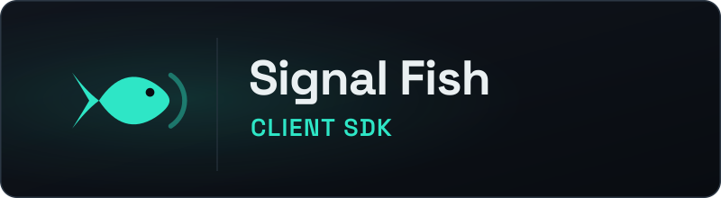

  

Pure-GDScript multiplayer signaling for Godot 4

# Signal Fish Godot Client

A drop-in Godot 4 addon for the Signal Fish protocol. Copy one folder, add a
`SignalFishClient` node, and connect, join rooms, and relay game data with
typed methods and signals. No C#, no GDExtension, nothing to compile - it
runs everywhere Godot runs, including web exports.

!!! note "AI disclosure"

    This project was developed with substantial assistance from Claude and
    Codex. Humans created the protocol concepts and core design and retained
    oversight of architecture and code review.

[Get started](getting-started.md){ .md-button .md-button--primary .sf-home-action }
[View on GitHub](https://github.com/Ambiguous-Interactive/signal-fish-client-godot){ .md-button .sf-home-action }

!!! note "Release status"

    Work in progress toward v1. The full v2 protocol surface and the v3
    session-plan signaling are shipped and covered by deterministic fixture
    tests. An Asset Library listing is planned for the v1 release; until
    then, install with a manual copy.

## Get connected

1. Copy `addons/signal_fish/` into your project.
2. Create a `SignalFishConfig`, set `app_id` and `endpoint_url`.
3. Add a `SignalFishClient` node and call `connect_to_server()`.
4. Handle `authenticated`, then `join_room()`.
5. Send and receive game data; everything is polled, never blocked.

The [quick start](getting-started.md) has the full first client. The demo
project ships runnable relay and P2P scenes.

## Pick the right path

| If you are building | Start with |
| --- | --- |
| A Godot 4 native or web game on the relay path | `SignalFishClient` and the [quick start](getting-started.md) |
| A game that needs binary game data | [Game Data](game-data.md) (`message_pack` negotiation) |
| A game that must survive disconnects | [Reconnection & Replay](reconnection.md) |
| A game with direct peer-to-peer traffic | Protocol v3 and the [mesh guide](mesh-guide.md) after the relay path works |
| A browser export | [Web Export](web-export.md) rules, then the same relay path |

## Read by task

- :material-rocket-launch:{ .lg .middle } **Installation & Quick Start**

    ---

    Install the addon, connect, authenticate, and join a room.

    [:octicons-arrow-right-24: Quick Start](getting-started.md)

- :material-code-tags:{ .lg .middle } **Client API Reference**

    ---

    Config, lifecycle methods, send methods, and state machines.

    [:octicons-arrow-right-24: Client API Reference](client.md)

- :material-bell:{ .lg .middle } **Events**

    ---

    One signal per server event, with typed payload objects.

    [:octicons-arrow-right-24: Events](events.md)

- :material-alert:{ .lg .middle } **Errors**

    ---

    The error-code enum, sentinels, and where each error surfaces.

    [:octicons-arrow-right-24: Errors](errors.md)

- :material-package-variant-closed:{ .lg .middle } **Game Data**

    ---

    JSON, MessagePack, and binary frames.

    [:octicons-arrow-right-24: Game Data](game-data.md)

- :material-connection:{ .lg .middle } **Reconnection & Replay**

    ---

    Tokens, missed-event replay, and opt-in auto-reconnect.

    [:octicons-arrow-right-24: Reconnection](reconnection.md)

- :material-web:{ .lg .middle } **Web Export**

    ---

    Browser rules: `wss://`, `Origin`, storage, and polling.

    [:octicons-arrow-right-24: Web Export](web-export.md)

- :material-test-tube:{ .lg .middle } **Deterministic Testing**

    ---

    Fixture suites, fake transports, and the CI entry point.

    [:octicons-arrow-right-24: Testing](testing.md)

- :material-mesh:{ .lg .middle } **Mesh (v3)**

    ---

    Turn v3 session plans into a `WebRTCMultiplayerPeer` mesh.

    [:octicons-arrow-right-24: Mesh Guide](mesh-guide.md)

